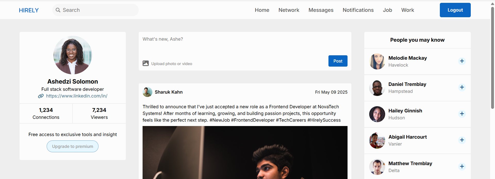

# Hirely — Professional Networking Web App

## 📌 Overview  
**Hirely** is a sleek and interactive web application inspired by platforms like LinkedIn. Built with HTML, CSS, and JavaScript, it allows users to log in, connect with other professionals, and share job-related posts. It simulates a real networking community using randomly generated user profiles from an external API.

## 🔑 Login Page  
- Basic authentication using `localStorage`  
- If the entered username and password match the stored credentials, the user is logged in and redirected to the homepage  

## 🏠 Home Page  
- Displays a feed of professional/job-related posts  
- Users can create and share their own posts in real time  
- Includes randomly generated user profiles fetched using the [Random User API](https://randomuser.me/), making the app feel dynamic and community-driven  

## 💡 Key Features  
- **Login with Local Storage Validation**  
- **Post Functionality** – Share job updates, announcements, or personal career news  
- **User Feed** – Dynamic feed showcasing posts from different users   
- **API Integration** – Simulated network of professionals via Random User API  

## 🛠 Technologies Used  
- **HTML5** – Semantic structure for login and feed pages  
- **CSS3** – Responsive styles and modern layout  
- **JavaScript (ES6)** – Local storage logic, post creation, API fetch, and DOM manipulation 

## Login details
To test the project use the following details 
- **Username** - me@gmail.com
-**Password** - Welcome123